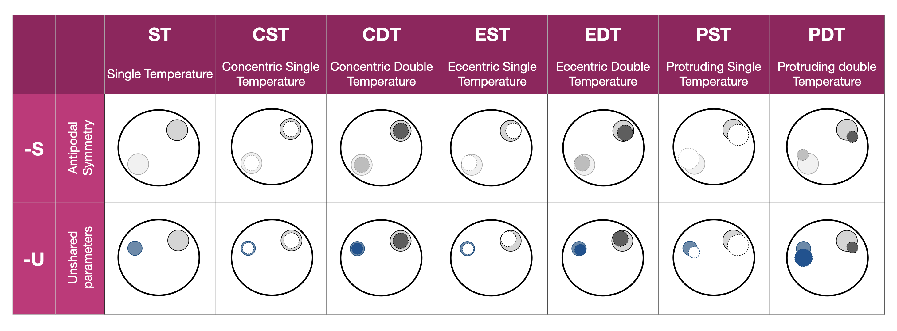

.. module:: xpsi.HotRegions

.. _hotregions:

HotRegions
==========

Instances of :class:`~.HotRegions.HotRegions` are objects representing a pair of
radiatively intense regions of the source photosphere. The class handles
:class:`~.HotRegions.HotRegions` instances, and applies the methods to compute
photon pulses from a pair of spots which may be related under some model.

Representations of two surface ``HotRegion`` objects of equal parameterisation complexity; the parameters of the two HotRegion objects can be shared ``-S`` or unshared ``-U``.

.. autoclass:: xpsi.HotRegions.HotRegions
    :members: embed, integrate, print_settings
    :show-inheritance:
